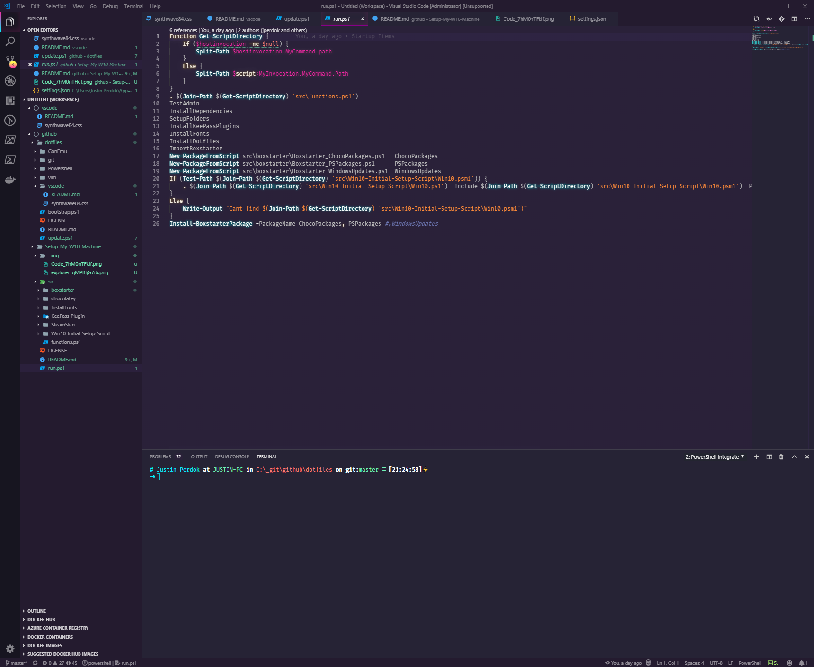
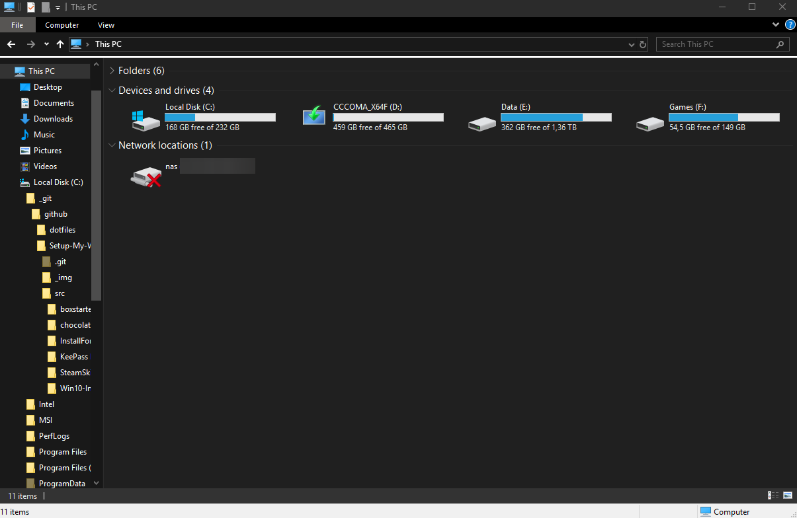

# Setup-My-W10-Machine

Used in this repository or borrowed code/ideas from:
 - https://github.com/justin-p/dotfiles
 - https://chocolatey.org/
 - https://boxstarter.org/
 - https://github.com/Disassembler0/Win10-Initial-Setup-Script
 - https://github.com/SteamCustomizer/Manager
 - https://github.com/jnko/SimpleDatabaseBackup
 - https://github.com/andrew-schofield/keepass2-haveibeenpwned
 - https://github.com/powerline/fonts
 - https://gist.github.com/jchandra74/5b0c94385175c7a8d1cb39bc5157365e
 - https://gist.githubusercontent.com/prasannavl/ce81599fb39cc50dbdb2/raw/db679a9fc0acba6557c9239940bbd33fbd1af85b/New-FileShortcut.ps1
 - https://github.com/JanDeDobbeleer/oh-my-posh
 - https://github.com/tonsky/FiraCode/wiki/VS-Code-Instructions
 - https://github.com/robb0wen/synthwave-vscode

  

